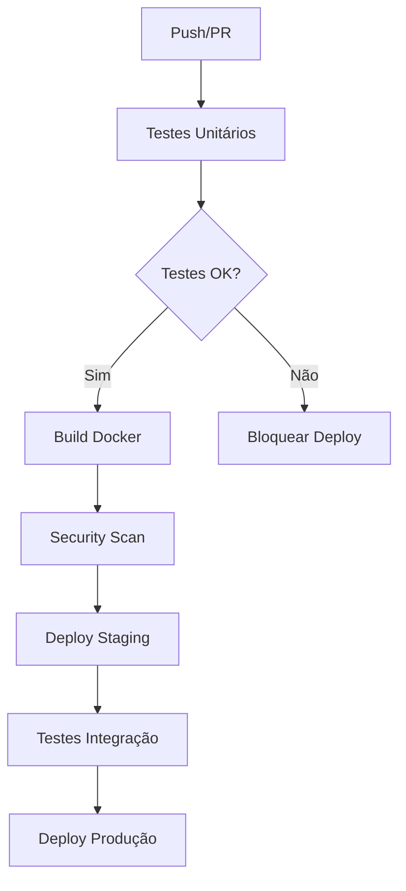

# 🧪 Pipeline de Testes - Tuwi Backend

Este documento descreve o pipeline de testes integrado ao sistema de deploy do Tuwi Backend.

## 📋 Visão Geral

O pipeline de testes foi configurado para garantir qualidade e confiabilidade antes de cada deploy:

- ✅ **Testes automáticos** em cada push/PR
- 🐳 **Build Docker** apenas após testes passarem  
- 🔒 **Scan de segurança** em todas as imagens
- 🚀 **Deploy automático** para staging/produção

## 🔄 Fluxo do Pipeline



## 🧪 Tipos de Testes

### 1. **Testes Críticos** (Obrigatórios)
- **CMS**: 111 testes (modelos, views, serializers)
- **Users**: Autenticação e autorização
- **Subscriptions**: Sistema de assinaturas
- **Courses**: 8 testes básicos (APIs essenciais)
- **Practice**: Testes básicos

### 2. **Testes de Qualidade** (Recomendados)
- Linting (flake8)
- Formatação (black, isort)  
- Segurança (bandit)

### 3. **Testes de Migração**
- Migração fresh database
- Verificação de conflitos
- Rollback testing

## 📂 Arquivos do Pipeline

### GitHub Actions Workflows
```
.github/workflows/
├── ci-cd.yml           # Pipeline principal (testes + build)
├── tests.yml           # Workflow dedicado para testes
├── deploy-staging.yml  # Deploy para staging
└── deploy-to-eks.yml   # Deploy para produção
```

### Configuração Docker
```
├── Dockerfile          # Multi-stage otimizado
├── .dockerignore       # Exclusões para build
└── docker-compose.test.yml  # Testes locais
```

## 🚀 Como Usar

### 1. **Executar Testes Localmente**

```bash
# Testes críticos (rápido)
make test-critical

# Testes por app
make test-cms          # CMS (111 testes)
make test-courses      # Courses básicos (8 testes)
make test-courses-all  # Todos os courses (90 testes - pode demorar)
make test-practice     # Practice

# Simular pipeline CI/CD
make ci-simulate

# Testes no Docker
make docker-test

# Verificações pré-deploy
make pre-deploy
```

### 2. **Pipeline Automático**

| Branch | Trigger | Ação |
|--------|---------|------|
| `develop` | Push | Testes + Deploy Staging |
| `main` | Push | Testes + Deploy Produção |
| `*` | Pull Request | Testes + Comentário no PR |

### 3. **Comandos Make Disponíveis**

```bash
make help              # Ver todos os comandos
make test-cms          # Testes do CMS
make test-users        # Testes de usuários  
make test-subscriptions # Testes de assinaturas
make test-ci           # Simular CI/CD
make docker-test       # Testes no Docker
```

## 📊 Resultados dos Testes

### Status Atual
- ✅ **CMS**: 111/111 testes passando
  - Models: 50/50 testes
  - Views: 32/32 testes  
  - Serializers: 29/29 testes
- ✅ **Courses**: 8/8 testes básicos passando (90 testes totais disponíveis)
- ✅ **Users**: Testes básicos passando
- ✅ **Subscriptions**: Testes básicos passando
- ✅ **Practice**: Testes básicos passando

### Métricas
- **Cobertura**: Relatório automático no Codecov
- **Performance**: Testes paralelos para velocidade
- **Confiabilidade**: Execução em ambiente isolado

## 🔧 Configuração

### Variáveis de Ambiente (CI/CD)
```bash
# Obrigatórias
DJANGO_SECRET_KEY=xxx
DATABASE_URL=postgresql://xxx
AWS_ACCOUNT_ID=xxx

# Opcionais
RATELIMIT_ENABLE=False
DEBUG=False
```

### Secrets GitHub
- `AWS_ACCOUNT_ID`: ID da conta AWS
- `DJANGO_SECRET_KEY_STAGING`: Secret key para staging
- `DATABASE_URL_STAGING`: URL do banco staging
- `STAGING_API_KEY`: API key para testes

## 🛠️ Manutenção

### Adicionar Novos Testes
1. Criar testes em `apps/[app]/tests/`
2. Adicionar no pipeline: `.github/workflows/ci-cd.yml`
3. Atualizar Makefile se necessário

### Otimizar Performance
- Use `--parallel` para testes paralelos
- Configure `--keepdb` para reutilizar DB
- Ajuste timeout nos workflows

### Debugging
```bash
# Ver logs detalhados
make test-ci --verbosity=2

# Testar com coverage
make test-coverage

# Verificar configuração
python manage.py check --deploy
```

## 📈 Melhorias Futuras

- [ ] Cache inteligente de dependências
- [ ] Testes de performance automatizados
- [ ] Notificações Slack/Teams
- [ ] Deployment blue-green
- [ ] Testes de carga automatizados

## 🆘 Solução de Problemas

### Testes Falhando
1. Verificar logs: GitHub Actions → Run details
2. Reproduzir localmente: `make test-ci`
3. Verificar dependências: `make install`

### Build Falhando
1. Verificar Dockerfile
2. Testar build local: `docker build .`
3. Verificar secrets/variáveis

### Deploy Falhando
1. Verificar configuração K8s
2. Verificar permissões AWS
3. Consultar logs do cluster

## 📚 Documentação Adicional

- [GitHub Actions](https://docs.github.com/en/actions)
- [Django Testing](https://docs.djangoproject.com/en/4.2/topics/testing/)
- [Docker Multi-stage](https://docs.docker.com/develop/dev-best-practices/)
- [AWS EKS](https://docs.aws.amazon.com/eks/)

---

**⚡ Pipeline configurado e funcionando!** 
Os testes agora fazem parte integral do processo de deploy, garantindo qualidade em produção.